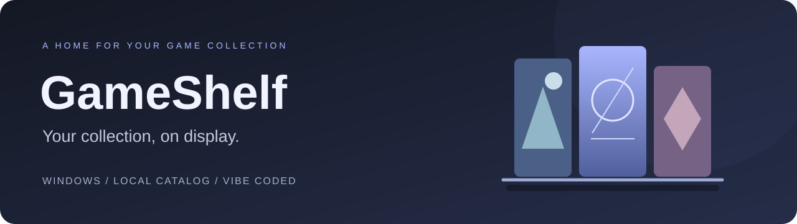
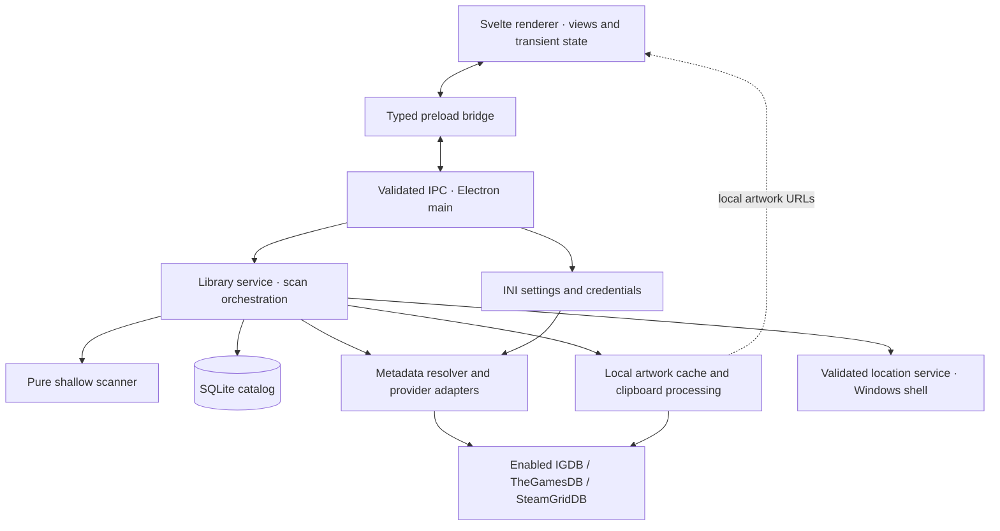
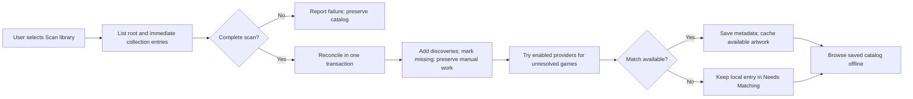

<div align="center">



# GameShelf

**Turn a drive full of game folders into a library worth browsing.**

A Windows desktop catalog with cover art, collections, and offline browsing.
Vibe coded with a small scope and a visible trail of decisions and tests.

[User guide](docs/USER_GUIDE.md) · [Development](docs/DEVELOPMENT.md) · [Architecture](docs/ARCHITECTURE.md) · [Roadmap](docs/V1_PLAN.md)

</div>

## A shelf for the games you keep

GameShelf gives your local game collection a visual home. Choose a folder, scan it when you want, and browse covers, descriptions, and collections in a dark, Playnite-inspired interface. Metadata providers are optional; the local catalog works without them.

- **Browse your way.** Home groups games by release decade or genre. Search and filter by title, year, genre, or collection.
- **Keep collections together.** Folders such as `[C] Favorites` become browsable collections.
- **Fill in the details.** Match titles through IGDB or TheGamesDB; add supplemental covers and backgrounds from SteamGridDB.
- **Make it yours.** Correct titles and descriptions, choose a match, or paste your own artwork. Normal scans preserve that work.
- **Take it offline.** Saved metadata and cached artwork stay local. Scans are manual, and missing entries stay in the catalog until you remove them.

The product is a catalog for roughly 50–100 games, with one library root. Game launching, installation, extraction, playtime tracking, cloud sync, telemetry, and automatic updates are outside its intended scope.

## Try the MVP

**Status: MVP implemented; portable distribution and final hardening pending.** This checkout runs from source on Windows. It does not yet include a packaging command or a verified standalone executable.

With Node.js 22.12 or newer installed, open a terminal in the downloaded or cloned project folder:

```powershell
npm ci
npm run dev
```

Choose **Choose library folder**, then **Scan library**. No provider account is needed to start browsing. The [user guide](docs/USER_GUIDE.md) walks through setup, collections, artwork, and everyday use.

> **Current MVP limitation:** the details button is labeled **Install**. For file entries, use **Open Container Folder** to browse safely in Explorer. Install can open ZIP/RAR files through Windows associations and can execute an EXE; this conflicts with the intended folder-only behavior and remains a [known issue](docs/DEVELOPMENT.md#known-limitations).

## Built through vibe coding

GameShelf is a vibe-coded project with explicit product boundaries: a focused desktop catalog, local storage, and optional enrichment. The repository keeps the reasoning alongside the implementation so you can explore how the project took shape.

The [decision ledger](docs/DECISIONS.md) records the tradeoffs. The [milestone log](docs/V1_PLAN.md) records what was implemented and which checks ran. [AGENTS.md](AGENTS.md) defines the guardrails for future work. Contributions should keep that same small, reviewable scope.

## Software architecture

Electron hosts a Svelte 5 interface. TypeScript contracts connect the interface to privileged services; SQLite stores the catalog, INI stores settings, and artwork lives in local files.



The renderer has no direct filesystem, database, credential, or provider access. Main validates requests and resolves stored game IDs. Network requests belong to enabled providers; artwork is served back from the local cache. The Windows shell action has the MVP limitation noted above.



Discovery and enrichment are separate: provider failure cannot undo a completed local scan. See [architecture](docs/ARCHITECTURE.md) for storage, path, matching, and maintenance contracts.

## Explore the project

| Start here | What you will find |
| --- | --- |
| [User guide](docs/USER_GUIDE.md) | Setup, browsing, matching, artwork, backups, and troubleshooting |
| [Development](docs/DEVELOPMENT.md) | Commands, verification, source layout, and known limitations |
| [Architecture](docs/ARCHITECTURE.md) | Process boundaries and domain contracts |
| [Decisions](docs/DECISIONS.md) | Scope and implementation choices |
| [Roadmap and verification](docs/V1_PLAN.md) | Completed MVP milestones and remaining delivery work |
| [Contributing](CONTRIBUTING.md) | Reporting bugs and making focused changes |

Visual direction takes inspiration from Playnite. Optional metadata and artwork come from IGDB, TheGamesDB, and SteamGridDB; GameShelf is an independent project.
